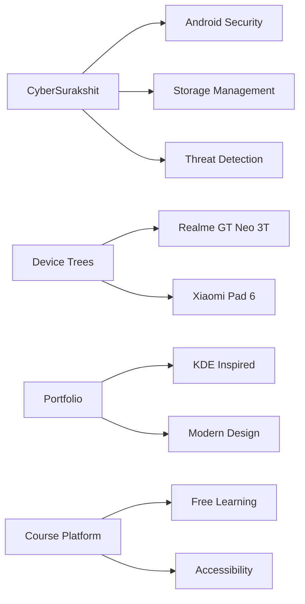

<!-- ASCII Art Header -->
```
  ███████╗ ██╗  ██╗███████╗██╗     ██╗      ██████╗ 
  ██╔════╝ ██║  ██║██╔════╝██║     ██║     ██╔═══██╗
  █████╗   ███████║█████╗  ██║     ██║     ██║   ██║
  ██╔══╝   ██╔══██║██╔══╝  ██║     ██║     ██║   ██║
  ███████╗ ██║  ██║███████╗███████╗███████╗╚██████╔╝
  ╚══════╝ ╚═╝  ╚═╝╚══════╝╚══════╝╚══════╝ ╚═════╝ 
```

<div align="center">
  
</div>

<div align="center">
  
</div>

<p align="left">  </p>

<!-- Matrix-style divider -->
<div align="center">
  
</div>

<details open>
<summary><b>🚀 About Me</b></summary>

<div align="center">
  <h3>✨ Turning Coffee into Code Since 2021 ☕</h3>
  
</div>

<div align="center">
  <h3>🎯 Quick Facts</h3>
  
</div>

<div align="left">
  
- 🎓 Computer Science Student at **SKSVMACET College**
- 💼 Ex-Intern at **AMBA SOFTWARES** working on Full Stack Development
- 🔭 Currently working on **Android Development** and **Open Source Projects**
- 🌱 Learning **Cloud Native Technologies** and **DevOps**
- 💡 Love to explore new technologies and contribute to open source
- 🚀 Building cool stuff with **Flutter**, **React**, and **Django**
- 🎮 When not coding: Building Custom ROMs and exploring Linux
</div>

<br>

<div align="center">
  <h3>🛠️ Tech Journey</h3>
  
  
  
  ```text
  🌟 Web Development  ==========>  React, Django, JavaScript, HTML/CSS
  📱 Mobile Development  =======>  Android, Kotlin, Flutter
  ⚙️ DevOps & Tools  ==========>  Docker, Kubernetes, Git
  💾 Databases  =============>  MySQL, MongoDB
  ```
</div>

<div align="center">
  <h3>💫 Favorite Tech Stack</h3>
  
  
  
  
  
  
  
</div>

</details>

<details open>
<summary><b>🏆 Achievements</b></summary>
<br>

<div align="center">
  <table>
    <tr>
      <td align="center">
        
        <p><b>Runner-Up</b><br>National Level Hackathon<br>(Codefiesta 4.0)</p>
      </td>
      <td align="center">
        
        <p><b>Second Prize</b><br>National Level Paper<br>Presentation</p>
      </td>
      <td align="center">
        
        <p><b>Winner</b><br>Mini-Project<br>Exhibition</p>
      </td>
    </tr>
  </table>
</div>

</details>

<details open>
<summary><b>💻 Projects</b></summary>
<br>

<div align="center">
  <a href="https://github.com/yourusername/cybersurakshit">
    
  </a>
  <a href="https://github.com/yourusername/device-trees">
    
  </a>
</div>



</details>

## 🛠️ Tech Arsenal

<!-- Dynamic Metrics Dashboard -->
<div align="center">
  
</div>

<div align="center">
  
        

</div>

## 📊 Stats Interface

<div align="center">
  


[](https://github.com/anuraghazra/github-readme-stats)

[](https://git.io/streak-stats)

[](https://github.com/ashutosh00710/github-readme-activity-graph)

</div>

## 🔌 Connect with me

<div align="center">
  <a href="https://linkedin.com/in/amrutesh-naregal">
    
  </a>
  <a href="mailto:amruteshnaregal1234@gmail.com">
    
  </a>
</div>

<!-- Matrix-style footer -->
<div align="center">
  
```diff
+@ @ @ @ @ @ @ @ @ @ @ @ @ @ @ @ @ @ @ @ @ @ @ @ @ @ @ @+
@@       o o                                           @@
@@       | |                                           @@
@@      _L_L_                                         @@
@@   ❮\/__-__\/❯ Programming isn't about what you know@@
@@   ❮(|~o.o~|)❯  It's about what you can figure out  @@
@@   ❮/ \`-'/ \❯                                      @@
@@     _/`U'\_                                        @@
@@    ( .   . )     .----------------------------.     @@
@@   / /     \ \    | while( ! (succeed=try() ) ) |    @@
@@   \ |  ,  | /    '----------------------------'     @@
@@    \|=====|/                                       @@
@@     |_.^._|                                        @@
@@     | |"| |                                        @@
@@     ( ) ( )   Testing leads to failure             @@
@@     |_| |_|   and failure leads to understanding   @@
+@ @ @ @ @ @ @ @ @ @ @ @ @ @ @ @ @ @ @ @ @ @ @ @ @ @ @ @+
```

</div>

<!-- Dynamic Quote -->
<div align="center">
  
</div>
